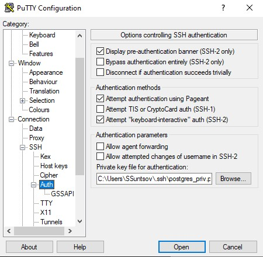
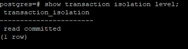

Генерируем публичный и приватный ssh ключи в программе puttygen.exe и сохраняем их:


**В программе Putty указываем сгенерированный приватный ключ для подключения к хочу с использованием ssh ключа:**



**Добавляем SSH ключ на хост:**
```
echo "ssh-rsa AAAAB3NzaC1yc2EAAAADAQABAAABAQCDNG5J6iEIC6oZd6a4zaogJxWq8sPSig6swAlnQ81PeWF/wFa+ocwd2sBg2vCeV5T9sr3s0V5iyA+2RxTYXBD8vr8lpeI6K2uL60sI/jfIJ30Q1+AHufGeAGfTa/FkK3BhflgXTs6iAbVrUH9NOYVmSpWy/rXWHTL8zJK17K9Ndy+GixCqfapcaM6+HQLt+nph8Pqmp+RUwkE2Mm0PvcTwglMV2WVF45MBmyVvRy4xy52mGrDI2eQ/B9F2UQp2WYupAjaeTiAPC1PyFNLzOxX3nVERQBLXEZzHq3tJZtFUeaBCWauh0r0yYuzvB1qQd9MLsvBiKJdvqNj3SulhkeOV rsa-key-20231008" >> .ssh/authorized_keys
```
**Устанавливаем PostgreSQL 15:**
```
sudo apt update && sudo apt upgrade -y && sudo sh -c 'echo "deb http://apt.postgresql.org/pub/repos/apt $(lsb_release -cs)-pgdg main" > /etc/apt/sources.list.d/pgdg.list' && wget --quiet -O - https://www.postgresql.org/media/keys/ACCC4CF8.asc | sudo apt-key add - && sudo apt-get update && sudo apt-get -y install postgresql-15
```
**Запускаем 2 сессии в putty и подключаемся к бд:**
```
sudo -u postgres psql
```
**В каждой сессии отключаем auto commit:**
```
\set AUTOCOMMIT OFF
```

**в первой сессии создаем новую таблицу и наполняем ее данными:**
```
create table persons(id serial, first_name text, second_name text);
insert into persons(first_name, second_name) values('ivan', 'ivanov');
insert into persons(first_name, second_name) values('petr', 'petrov');
commit;
```

**смотрим текущий уровень изоляции:**
```
show transaction isolation level;
```



**в первой сессии добавить новую запись**
```
insert into persons(first_name, second_name) values('sergey', 'sergeev');
```

**сделать во второй сессии**
```
select * from persons; 
```

Новая запись не видна, т.к. в первой сессии транзакция не завершена

**завершить первую транзакцию**
```
commit;
```

**сделать во второй сессии**
```
select * from persons;
```
видите ли вы новую запись и если да то почему? <br>
Да, т.к. транзакция в первой сессии завершена и в режиме read commited в рамках одной транзакции видны изменения, которые были внесены в других сессиях.

**начать новые но уже repeatable read транзации**
```
set transaction isolation level repeatable read;
```

**в первой сессии добавить новую запись**
```
insert into persons(first_name, second_name) values('sveta', 'svetova');
```

**сделать во второй сессии**
```
select * from persons;
```
видите ли вы новую запись и если да то почему? <br>
Нет, т.к. транзакция не была завершена в первой сессии

**завершить первую транзакцию**
```
commit;
```

**сделать во второй сессии**
```
select * from persons;
```
видите ли вы новую запись и если да то почему? <br>
Нет, т.к. в режиме repeatable read видны только те изменения, которые были сделаны до начала транзакции. При выполнении запроса select * from persons создается новая транзакция и пока она не будет завершена, изменения, внесенные в других сессиях\транзацкиях в данной транзакции видны не будут.

**завершить вторую транзакцию**
```
commit;
```

**сделать во второй сессии**
```
select * from persons;
```
видите ли вы новую запись и если да то почему  <br>
Да, т.к. после завершения транзакции в данной сессии стали видны изменния, которые были сделаны во время выполнения данной транзакции. (особенность уровня изоляции транзакций repeatable read)
