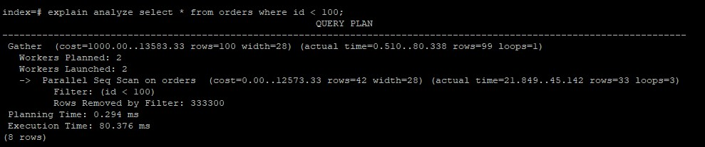
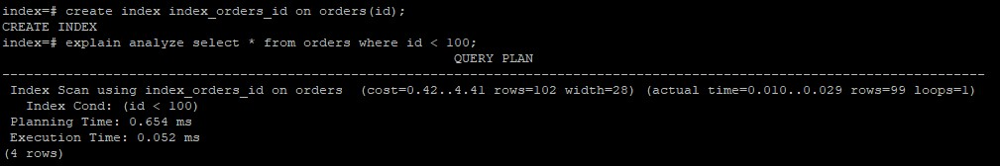
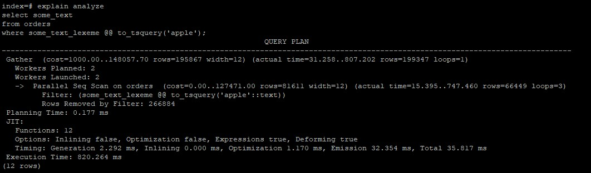
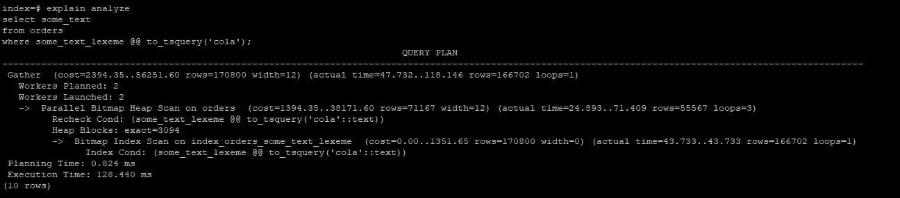
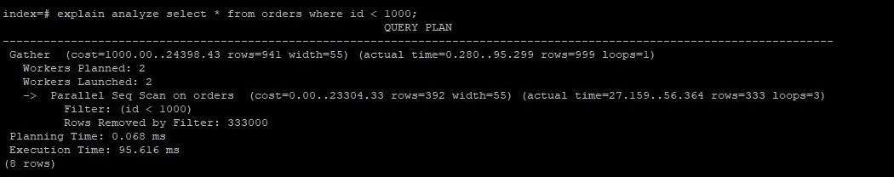
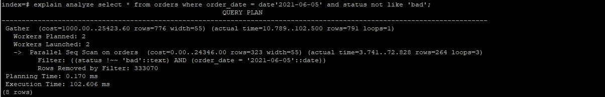
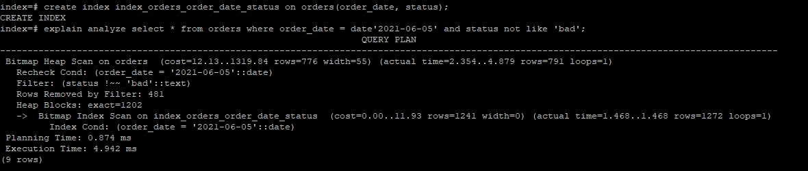
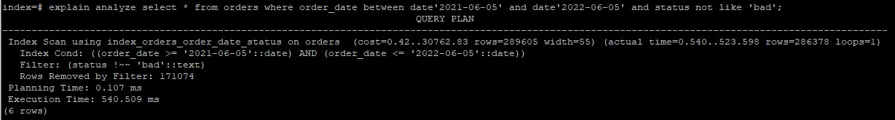
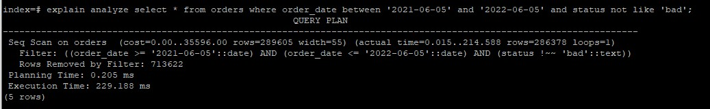

**Создаем базу таблицу orders и наполняем ее данными:**
```
create table orders (
    id int,
    user_id int,
    order_date date,
    status text,
    some_text text
);
```
```
insert into orders(id, user_id, order_date, status, some_text)
select generate_series, (random() * 500), date'2021-01-01' + (random() * 800)::int as order_date
        , (array['good', 'bad', 'ok', 'nice', 'best'])[(random() * 4)::int]
        , concat_ws(' ', (array['apple', 'banana', 'juice'])[(random() * 5)::int]
            , (array['cola', 'is', 'the', 'best', 'drink', 'ever'])[(random() * 6)::int]
            , (array['fanta', 'is', 'the', 'worst', 'drink', 'ever'])[(random() * 6)::int]
            )
from generate_series(1, 1000000);
```

**Строим план запроса без использования индексов:**
```
explain analyze select * from orders where id=100;
```
<br>

**Создать индекс к какой-либо из таблиц вашей БД**
```
create index index_orders_id on orders(id);
```

<br>
   
**Реализовать индекс для полнотекстового поиска**
В таблицу добавляем колонку, которая будет содержать лексемы для колонки some_text:<br>
```
alter table orders add column some_text_lexeme tsvector;

update orders
set some_text_lexeme = to_tsvector(some_text);
```

Строим план запроса без использования индексов:
```
explain analyze
select some_text
from orders
where some_text_lexeme @@ to_tsquery('apple');
```

<br>

Создаем GIN индекс для полнотекстового поиска:
```
CREATE INDEX index_orders_some_text_lexeme ON orders USING GIN (some_text_lexeme);
```
```
explain analyze
select some_text
from orders
where some_text_lexeme @@ to_tsquery('cola');
```
<br>

**Реализовать индекс на часть таблицы или индекс на поле с функцией**

Создаем индекс на часть таблицы. Берем столбец id и значения > 10000:

```
create index index_orders_id on orders(id) where id > 10000;
```
```
explain analyze select * from orders where id = 100;
```
В плане запроса видно, что выполняется последовательное чтение таблицы, т.к. значение поля id < 10000

<br>

```
explain analyze select * from orders where id > 10001 and id < 15000;
```

<br>

**Создать индекс на несколько полей**
```
create index index_orders_order_date_status on orders(order_date, status);
```
Без индекса:<br>
<br>

С индексом:<br>
<br>

НО!<br>
С индексом:<br>
<br>

Без индекса:<br>
<br>

Получается так, что индексы хорошо работают не со всеми запросами. 

