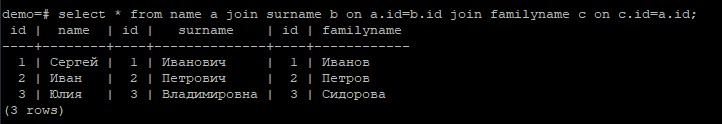
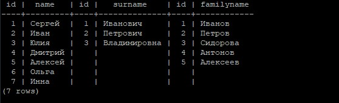
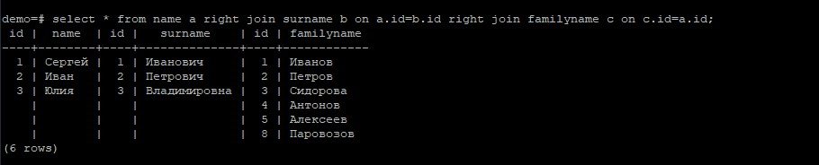
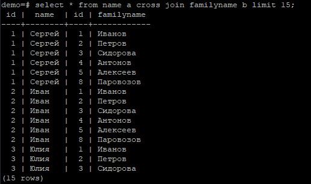
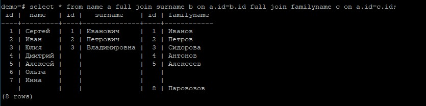
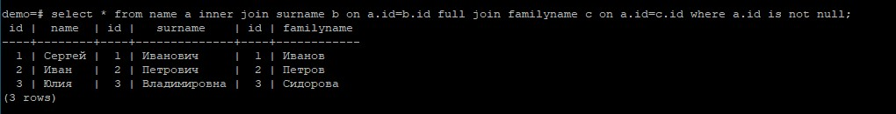

В базе данных демо создаем три таблицы и наполняем их данными:
```
create table name (id serial, name text);
create table surname (id serial, surname text);
create table familyname (id serial, familyname text);
insert into name values (1,'Сергей'),(2,'Иван'),(3,'Юлия'),(4,'Дмитрий'),(5,'Алексей'),(6,'Ольга'),(7,'Инна');
insert into surname values(1,'Иванович'),(2,'Петрович'),(3,'Владимировна');
insert into familyname values(1,'Иванов'),(2,'Петров'),(3,'Сидорова'),(4,'Антонов'),(5,'Алексеев'),(8,'Паровозов');
```

**Реализовать прямое соединение двух или более таблиц**
```
select * from name a join surname b on a.id=b.id join familyname c on c.id=a.id;
```


**Реализовать левостороннее (или правостороннее) соединение двух или более таблиц**<br>
Левостороннее соединение:
```
select * from name a left join surname b on a.id=b.id left join familyname c on c.id=a.id;
```


Правостороннее соединение:
```
select * from name a right join surname b on a.id=b.id right join familyname c on c.id=a.id;
```

    
**Реализовать кросс соединение двух или более таблиц**
```
select * from name a cross join familyname b limit 15;
```


**Реализовать полное соединение двух или более таблиц**
```
select * from name a full join surname b on a.id=b.id full join familyname c on a.id=c.id;
```


**Реализовать запрос, в котором будут использованы разные типы соединений**
```
select * from name a inner join surname b on a.id=b.id full join familyname c on a.id=c.id where a.id is not null;
```



**Задание со звездочкой**<br>
**Придумайте 3 своих метрики на основе показанных представлений, отправьте их через ЛК, а так же поделитесь с коллегами в слаке**
```
SELECT relname, trunc(100*n_dead_tup/(n_live_tup+1))::float "ratio%" FROM pg_stat_user_tables; --смотрим процентное соотношение мертвых строк в таблице
```

```
select datname, deadlocks from pg_stat_database; --количество дедлоков в базе
```
```
CREATE EXTENSION pg_stat_statements;
SELECT * FROM pg_stat_statements ORDER BY total_time DESC limit 10; -- топ 10 долгих запросов
```
