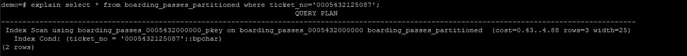
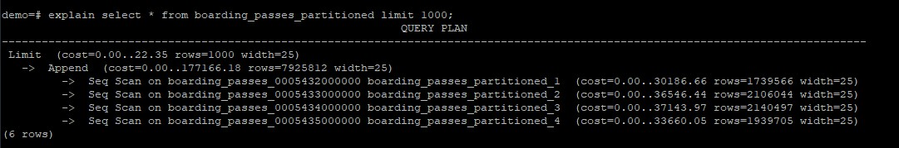

**Скачиваем и распаковываем базу данных demo_big:**
```
wget https://edu.postgrespro.ru/demo_big.zip -O demo_big.zip && unzip demo_big.zip
```

**Импортируем дамп БД:**
```
psql < demo_big.sql
```

**Секционировать будем таблицу bookings.bookings по диапазону.**<br>
**Для этого необходимо:**<br>
1. Получить DDL скрипт таблицы:
```
pg_dump -d demo -s -t bookings.bookings
```

2. Создаем копию таблицы при помощи полученного DDL скрипта, но указываем тип партиционирования (по диапазону):
```
CREATE TABLE bookings.boarding_passes_partitioned (
    ticket_no character(13) NOT NULL,
    flight_id integer NOT NULL,
    boarding_no integer NOT NULL,
    seat_no character varying(4) NOT NULL
) PARTITION BY RANGE (ticket_no);

ALTER TABLE ONLY bookings.boarding_passes_partitioned
    ADD CONSTRAINT boarding_passes_flight_id_boarding_no_k UNIQUE (flight_id, boarding_no, ticket_no);

ALTER TABLE ONLY bookings.boarding_passes_partitioned
    ADD CONSTRAINT boarding_passes_flight_id_seat_no_k UNIQUE (flight_id, seat_no, ticket_no);

ALTER TABLE ONLY bookings.boarding_passes_partitioned
    ADD CONSTRAINT boarding_passes_pk PRIMARY KEY (ticket_no, flight_id);

ALTER TABLE ONLY bookings.boarding_passes_partitioned
    ADD CONSTRAINT boarding_passes_ticket_no_fk FOREIGN KEY (ticket_no, flight_id) REFERENCES bookings.ticket_flights(ticket_no, flight_id);
```

3. Создаем партиции с диапазонами по номерам билетов:

```
CREATE TABLE bookings.boarding_passes_0005432000000 PARTITION OF bookings.boarding_passes_partitioned
    FOR VALUES FROM ('0005432000000') TO ('0005433000000');

CREATE TABLE bookings.boarding_passes_0005433000000 PARTITION OF bookings.boarding_passes_partitioned
    FOR VALUES FROM ('0005433000000') TO ('0005434000000');

CREATE TABLE bookings.boarding_passes_0005434000000 PARTITION OF bookings.boarding_passes_partitioned
    FOR VALUES FROM ('0005434000000') TO ('0005435000000');

CREATE TABLE bookings.boarding_passes_0005435000000 PARTITION OF bookings.boarding_passes_partitioned
    FOR VALUES FROM ('0005435000000') TO ('0005436000000');
```

4. Копируем данные из исходной таблицы в bookings.bookings_partitioned:

```
insert into bookings.boarding_passes_partitioned select * from bookings.boarding_passes;
```

5. Проверяем, что данные разделились по партициям:

```
explain select * from boarding_passes_partitioned where ticket_no='0005432125087';
```



```
explain select * from boarding_passes_partitioned limit 1000;
```



6. Удаляем старую таблицу:

```
drop table bookings.boarding_passes cascade;
```

