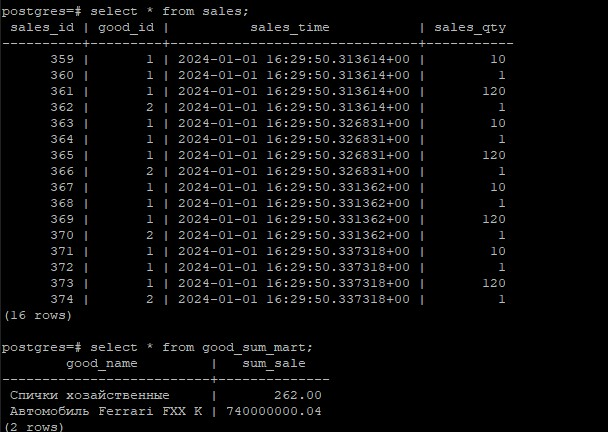
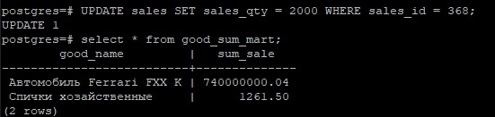
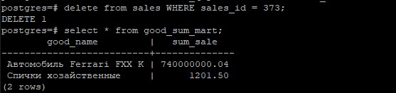

1. Импортируем дамп БП:
```
psql < hw_triggers.sql
```
2. Создаем триггерную функцию и триггер, который будет вызывать данную функцию и обновлять данные в витрине:
```
CREATE OR REPLACE FUNCTION good_sum_mart1()
RETURNS TRIGGER AS $$
BEGIN
    CASE TG_OP
      WHEN 'INSERT' THEN
        -- Обновление суммы продаж товара для существующей записи
        UPDATE good_sum_mart SET sum_sale = (
            SELECT SUM(g.good_price * s.sales_qty)
            FROM goods g
            INNER JOIN sales s ON s.good_id = g.goods_id
            WHERE g.good_name = (SELECT good_name FROM goods WHERE goods_id = NEW.good_id)
        )
        WHERE good_name = (SELECT good_name FROM goods WHERE goods_id = NEW.good_id);
       
        -- Если записи о товаре нет, то вставляем новую запись
        IF NOT FOUND THEN
            INSERT INTO good_sum_mart (good_name, sum_sale)
            VALUES ((SELECT good_name FROM goods WHERE goods_id = NEW.good_id), (SELECT good_price FROM goods WHERE goods_id = NEW.good_id) * NEW.sales_qty);
        END IF;

    WHEN 'UPDATE' THEN
    
        -- Обновление суммы продаж товара для существующей записи
        UPDATE good_sum_mart SET sum_sale = (
            SELECT SUM(g.good_price * s.sales_qty)
            FROM goods g
            INNER JOIN sales s ON s.good_id = g.goods_id
            WHERE g.good_name = (SELECT good_name FROM goods WHERE goods_id = NEW.good_id)
        )
        WHERE good_name = (SELECT good_name FROM goods WHERE goods_id = NEW.good_id);
       
    WHEN 'DELETE' THEN
                
        -- После удаления записи в sales делаем обновление общей суммы продаж товара
        UPDATE good_sum_mart SET sum_sale = (
            SELECT SUM(g.good_price * s.sales_qty)
            FROM goods g
            INNER JOIN sales s ON s.good_id = g.goods_id
            WHERE g.good_name = (SELECT good_name FROM goods WHERE goods_id = OLD.good_id)
        )
        WHERE good_name = (SELECT good_name FROM goods WHERE goods_id = OLD.good_id);
        
    END CASE;

    RETURN NEW;
END;
$$ LANGUAGE plpgsql;
```

```
CREATE TRIGGER tr_for_test1
AFTER INSERT OR UPDATE OR DELETE    
ON sales
FOR EACH ROW
EXECUTE PROCEDURE good_sum_mart1();
```

3. Проверяем работу триггера.<br>
Добавляем данные в таблицу sales:
```
INSERT INTO sales (good_id, sales_qty) VALUES (1, 10), (1, 1), (1, 120), (2, 1);
INSERT INTO sales (good_id, sales_qty) VALUES (1, 10), (1, 1), (1, 120), (2, 1);
INSERT INTO sales (good_id, sales_qty) VALUES (1, 10), (1, 1), (1, 120), (2, 1);
INSERT INTO sales (good_id, sales_qty) VALUES (1, 10), (1, 1), (1, 120), (2, 1);
```
Проверяем обновление витрины:
```
select * from sales;
select * from good_sum_mart;
```

<br>

Обновим количество проданного товара в таблице sales и проверим обновление витрины:
```
UPDATE sales SET sales_qty = 2000 WHERE sales_id = 368;
select * from good_sum_mart;
```
<br>

Удалим одну продажу в таблице sales и проверим обновление витрины:
```
delete from sales WHERE sales_id = 373;
```



**Задание со звездочкой: Чем такая схема (витрина+триггер) предпочтительнее отчета, создаваемого "по требованию" (кроме производительности)? Подсказка: В реальной жизни возможны изменения цен**<br>

Цена фиксируется на момент продажи, а не берется из справочника товаров.
