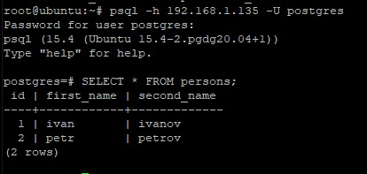
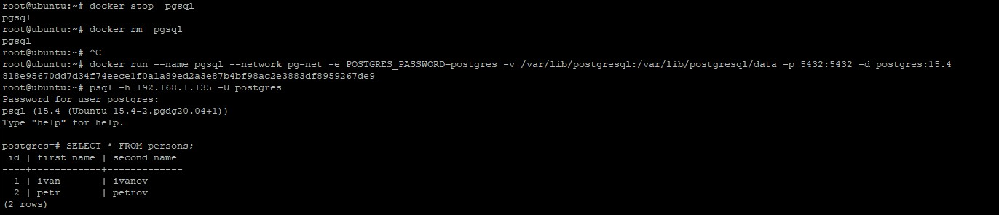

**Cоздать ВМ с Ubuntu 20.04/22.04 или развернуть докер любым удобным способом** <br>
Создана ВМ с Ubuntu 20.04 в Oracle VirtualBox

**Поставить на нем Docker Engine**
```
sudo apt install docker.io && apt install docker-compose
```

**Cделать каталог /var/lib/postgres**
```
mkdir /var/lib/postgres
```

**Развернуть контейнер с PostgreSQL 15 смонтировав в него /var/lib/postgresql**
Создаем docker сеть для postgresql
```
docker network create pg-net
```
Разворачиваем контейнер с PostgreSQL 15.4
```
docker run --name pgsql --network pg-net -e POSTGRES_PASSWORD=postgres -v /var/lib/postgresql:/var/lib/postgresql/data -p 5432:5432 -d postgres:15.4
```

**Развернуть контейнер с клиентом postgres**
```
docker run -it --rm --network pg-net --name pg-client postgres:15.4 psql -h pgsql -U postgres
```
Вводим пароль, который был указан при созданн контейнера с postgresql 15.4 (переменная POSTGRES_PASSWORD)

**Подключится из контейнера с клиентом к контейнеру с сервером и сделать таблицу с парой строк**
```
docker run -it --rm --network pg-net --name pg-client postgres:15.4 psql -h pgsql -U postgres
create table persons(id serial, first_name text, second_name text);
insert into persons(first_name, second_name) values('ivan', 'ivanov');
insert into persons(first_name, second_name) values('petr', 'petrov');
```

**Подключится к контейнеру с сервером с ноутбука/компьютера извне инстансов GCP/ЯО/места установки докера**


**Удалить контейнер с сервером**
```
docker stop  pgsql
docker rm  pgsql
```

**Создать его заново**
Подключится снова из контейнера с клиентом к контейнеру с сервером
Проверить, что данные остались на месте



