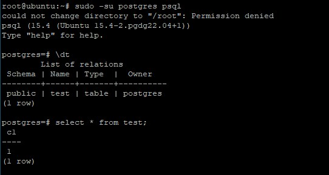

**Создайте виртуальную машину c Ubuntu 20.04/22.04 LTS в GCE/ЯО/Virtual Box/докере**<br>
Создана ВМ с Ubuntu 20.04 в Oracle VirtualBox

**Поставьте на нее PostgreSQL 15 через sudo apt**
```
sudo apt update && \
sudo apt upgrade -y && \
sudo sh -c 'echo "deb http://apt.postgresql.org/pub/repos/apt $(lsb_release -cs)-pgdg main" > /etc/apt/sources.list.d/pgdg.list' && \
wget --quiet -O - https://www.postgresql.org/media/keys/ACCC4CF8.asc | sudo apt-key add - && \
sudo apt-get update && \
sudo apt-get -y install postgresql-15
```
**Проверьте что кластер запущен sudo -u postgres pg_lsclusters**
```
sudo -u postgres pg_lsclusters
```

**Зайдите из под пользователя postgres в psql и сделайте произвольную таблицу с произвольным содержимым**
```
sudo -su postgres psql
create table test(c1 text);
insert into test values('1');
\q
```

**Остановите postgres**
```
sudo -u postgres pg_ctlcluster 15 main stop
```

**Создайте новый диск к ВМ размером 10GB**<br>
добавьте свеже-созданный диск к виртуальной машине - надо зайти в режим ее редактирования и дальше выбрать пункт attach existing disk
проинициализируйте диск согласно инструкции и подмонтировать файловую систему, только не забывайте менять имя диска на актуальное, в вашемслучае это скорее всего будет /dev/sdb - https://www.digitalocean.com/community/tutorials/how-to-partition-and-format-storage-devices-in-linux
перезагрузите инстанс и убедитесь, что диск остается примонтированным (если не так смотрим в сторону fstab)
После перезагрузки диск автоматически не примонтируется. Нужно добавить точку монтирования в файл /etc/fstab:<br>
/dev/sdb1 /mnt/data ext4 defaults 0 2<br>


**Сделайте пользователя postgres владельцем /mnt/data**
```
chown -R postgres:postgres /mnt/data/
```
**Перенесите содержимое /var/lib/postgres/15 в /mnt/data**
```
mv /var/lib/postgresql/15 /mnt/data
```

**попытайтесь запустить кластер**
```
sudo -u postgres pg_ctlcluster 15 main start
```
не получилось, т.к. postgres ищет директорию /var/lib/postgresql/15

**Задание: найти конфигурационный параметр в файлах раположенных в /etc/postgresql/15/main который надо поменять и поменяйте его**
```
nano /etc/postgresql/15/main/postgresql.conf
```
меняем параметр data_directory = '/mnt/data/15/main'

**Попытайтесь запустить кластер**
```
sudo -u postgres pg_ctlcluster 15 main start
```
получилось, т.к. изменили data_directory


**Зайдите через через psql и проверьте содержимое ранее созданной таблицы**



**Задание со звездочкой***
не удаляя существующий инстанс ВМ сделайте новый, поставьте на его PostgreSQL, удалите файлы с данными из /var/libpostgres, перемонтируйте внешний диск который сделали ранее от первой виртуальной машины ко второй и запустите PostgreSQL на второй машине такчтобы он работал с данными на внешнем диске, расскажите как вы это сделали и что в итоге получилось.

Т.к. на внешнем диск уже создан раздел с фаловой системой, то этот диск достаточно смонтировать командой
```
mount -o defaults /dev/sdс1 /mnt/data
```
далее в конфигурационном файле /etc/postgresql/15/main/postgresql.conf меняем параметр data_directory = '/mnt/data/15/main'<br>
Запускаем постгрес
```
sudo -u postgres pg_ctlcluster 15 main start
```
Проверяем данные


