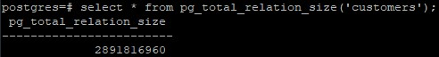

**Создать инстанс ВМ с 2 ядрами и 4 Гб ОЗУ и SSD 10GB**<br>
Установить на него PostgreSQL 15 с дефолтными настройками<br>
Создать БД для тестов: выполнить 
```
create database perf_test;
pgbench -i perf_test;
```

**Запустить pgbench**
```
pgbench -c8 -P 6 -T 60 -U postgres perf_test
```


**Применить параметры настройки PostgreSQL из прикрепленного к материалам занятия файла**<br>
Протестировать заново<br>
Что изменилось и почему?<br>
Ничего не изменилось. Я так понимаю, что должна была увеличиться производительность кластера, т.к. увеличили размер буферов и т.д., но у меня ничего не изменилось. Я подумал, что настройки не применились к кластеру, но они применились.


**Создать таблицу с текстовым полем и заполнить случайными или сгенерированными данным в размере 1млн строк**
```
create table customers(id serial, fio char(200));
insert into customers(fio) select 'name' from generate_series(1,1000000);
```

**Посмотреть размер файла с таблицей**<br>
```
select * from pg_total_relation_size('customers');
```


**5 раз обновить все строчки и добавить к каждой строчке любой символ**<br>
Посмотреть количество мертвых строчек в таблице и когда последний раз приходил автовакуум
```
SELECT relname, n_live_tup, n_dead_tup, trunc(100*n_dead_tup/(n_live_tup+1))::float "ratio%", last_autovacuum FROM pg_stat_user_TABLEs WHERE relname = 'customers';
```


**Подождать некоторое время, проверяя, пришел ли автовакуум**


**5 раз обновить все строчки и добавить к каждой строчке любой символ**<br>
Посмотреть размер файла с таблицей<br>


**Отключить Автовакуум на конкретной таблице**
```
alter table customers set(autovacuum_enabled = off);
```

**10 раз обновить все строчки и добавить к каждой строчке любой символ**<br>
Посмотреть размер файла с таблицей<br>


**Объясните полученный результат**<br>
Размер файла таблицы увеличивается не зависимо от того, влючен автовакуум или нет. Автовакуум чистит данные, помеченные для удаления. При этом размер таблицы в байтах не меняется. Чтобы дефрагментировать таблицу нужно выполнить команду 
```
vacuum full customers;
```

**Не забудьте включить автовакуум**<br>
```
alter table customers set(autovacuum_enabled = on);
```

**Задание со *:**
Написать анонимную процедуру, в которой в цикле 10 раз обновятся все строчки в искомой таблице.<br>
Не забыть вывести номер шага цикла.
```
do $$declare i record;
  begin
    for i in 1..10
      loop
        raise notice 'step %: update customers set fio = md5(random()::text)',i;
        update customers set fio = md5(random()::text);
      end loop;
end$$;
```
