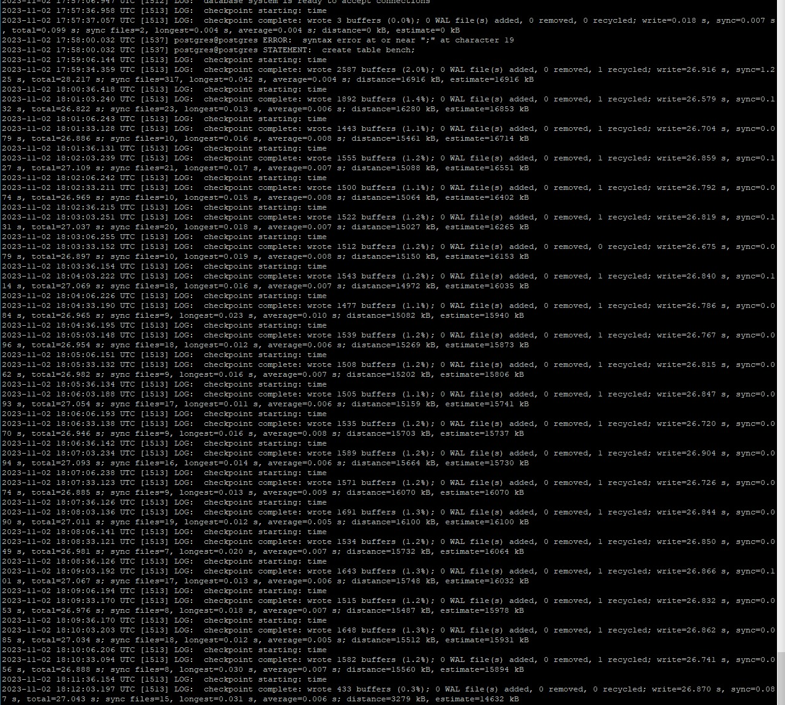
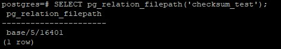
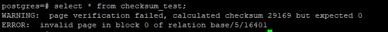

**Настройте выполнение контрольной точки раз в 30 секунд.**
```
alter system set checkpoint_timeout=30;
```

**10 минут c помощью утилиты pgbench подавайте нагрузку.**
```
 pgbench -c8 -P 6 -T 600 -U postgres bench
```

**Измерьте, какой объем журнальных файлов был сгенерирован за это время. Оцените, какой объем приходится в среднем на одну контрольную точку.**

По самим WAL файлам понять не получается. WAL файл герируется размером 16Мб, т.к. это прописано в настройках кластера. Но какой фактически объем был сгенерирован - не известно.<br>
Я посмотрел логи сервера<br>
```
cat /var/log/postgresql/postgresql-15-main.log
```
Содержимое файла:<br>
<br>
Из лога я посчичтал, что на одну контрольную точку приходится 40-60Кб данных.<br>

**Проверьте данные статистики: все ли контрольные точки выполнялись точно по расписанию. Почему так произошло?**<br>
Судя по логфайлу выше контрольные точки выполнялись каждые 30 сек.<br>

**Сравните tps в синхронном/асинхронном режиме утилитой pgbench. Объясните полученный результат.**<br>

Выключаем синхронизацию:
```
PGOPTIONS="-c synchronous_commit=off" pgbench -c8 -P 6 -T 60 -U postgres bench
```
```
postgres@ubuntu:~$ PGOPTIONS="-c synchronous_commit=off" pgbench -c8 -P 6 -T 60 -U postgres bench
pgbench (15.4 (Ubuntu 15.4-2.pgdg22.04+1))
starting vacuum...end.
progress: 6.0 s, 776.3 tps, lat 10.202 ms stddev 5.580, 0 failed
progress: 12.0 s, 804.2 tps, lat 9.899 ms stddev 5.301, 0 failed
progress: 18.0 s, 804.1 tps, lat 9.919 ms stddev 5.371, 0 failed
progress: 24.0 s, 784.2 tps, lat 10.161 ms stddev 5.599, 0 failed
progress: 30.0 s, 796.5 tps, lat 10.008 ms stddev 5.838, 0 failed
progress: 36.0 s, 739.0 tps, lat 10.788 ms stddev 6.039, 0 failed
progress: 42.0 s, 788.7 tps, lat 10.103 ms stddev 5.691, 0 failed
progress: 48.0 s, 660.6 tps, lat 12.066 ms stddev 6.381, 0 failed
progress: 54.0 s, 797.5 tps, lat 9.997 ms stddev 5.500, 0 failed
progress: 60.0 s, 814.0 tps, lat 9.798 ms stddev 5.478, 0 failed
transaction type: <builtin: TPC-B (sort of)>
scaling factor: 1
query mode: simple
number of clients: 8
number of threads: 1
maximum number of tries: 1
duration: 60 s
number of transactions actually processed: 46599
number of failed transactions: 0 (0.000%)
latency average = 10.259 ms
latency stddev = 5.703 ms
initial connection time = 30.916 ms
tps = 776.788281 (without initial connection time)
```

Включаем синхронизацию:
```
PGOPTIONS="-c synchronous_commit=oт" pgbench -c8 -P 6 -T 60 -U postgres bench
```
```
postgres@ubuntu:~$ PGOPTIONS="-c synchronous_commit=on" pgbench -c8 -P 6 -T 60 -U postgres bench
pgbench (15.4 (Ubuntu 15.4-2.pgdg22.04+1))
starting vacuum...end.
progress: 6.0 s, 160.8 tps, lat 48.720 ms stddev 34.341, 0 failed
progress: 12.0 s, 155.2 tps, lat 51.684 ms stddev 37.710, 0 failed
progress: 18.0 s, 167.9 tps, lat 47.847 ms stddev 29.329, 0 failed
progress: 24.0 s, 156.2 tps, lat 51.247 ms stddev 33.126, 0 failed
progress: 30.0 s, 170.7 tps, lat 46.891 ms stddev 25.785, 0 failed
progress: 36.0 s, 165.3 tps, lat 48.260 ms stddev 29.023, 0 failed
progress: 42.0 s, 177.7 tps, lat 45.057 ms stddev 25.227, 0 failed
progress: 48.0 s, 176.9 tps, lat 45.045 ms stddev 27.106, 0 failed
progress: 54.0 s, 170.6 tps, lat 46.986 ms stddev 29.278, 0 failed
progress: 60.0 s, 172.0 tps, lat 46.441 ms stddev 29.439, 0 failed
transaction type: <builtin: TPC-B (sort of)>
scaling factor: 1
query mode: simple
number of clients: 8
number of threads: 1
maximum number of tries: 1
duration: 60 s
number of transactions actually processed: 10047
number of failed transactions: 0 (0.000%)
latency average = 47.733 ms
latency stddev = 30.195 ms
initial connection time = 32.376 ms
tps = 167.410034 (without initial connection time)

```
При выключенном синхронном режиме сервер не дожидается записи данных WAL на диск и переходит к выполнению следующей транзакции. <br>
Это значительно увеличивает производительность  при выполнении транзакций, но при этом возрастает риск потери данных в случае краха сервера.<br>

**Создайте новый кластер с включенной контрольной суммой страниц.** <br>
 Создайте таблицу. Вставьте несколько значений. Выключите кластер. Измените пару байт в таблице. Включите кластер и сделайте выборку из таблицы. Что и почему произошло? как проигнорировать ошибку и продолжить работу?<br>
 
Останавливаем кластер
```
pg_ctlcluster 15 main stop
```

Включаем checksums
```
/usr/lib/postgresql/15/bin/pg_checksums -e /var/lib/postgresql/15/main/
```

Создаем таблицу и наполняем данными
```
create table checksum_test(id serial, name varchar(100));
insert into checksum_test(name) select 'name' from generate_series(1,100);
```

Ищем физическое расположение таблицы:
```
SELECT pg_relation_filepath('checksum_test');
```


Останавливаем кластер
```
pg_ctlcluster 15 main stop
```

Меняем содержимое файла<br>

Запускаем кластер 
```
pg_ctlcluster 15 main start
```

Делаем выборку из таблицы
```
select * from checksum_test;
```

Получаем ошибку:<br>


Чтобы проигнорировать ошибку нужно выполнить 
```
SET ignore_checksum_failure = on;
```
