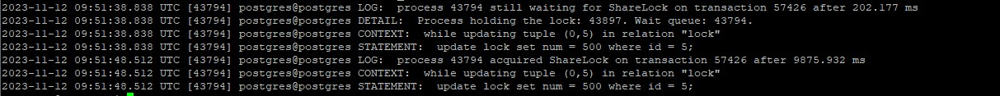
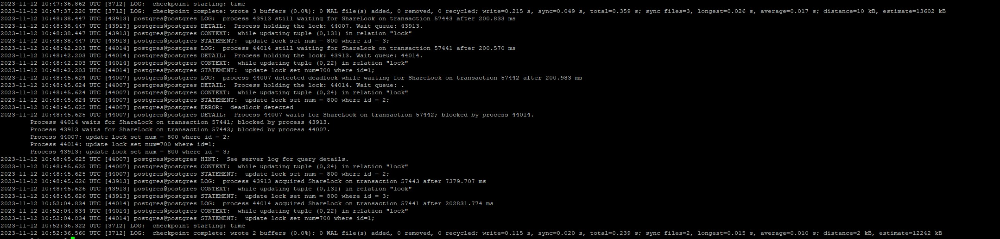

**Настройте сервер так, чтобы в журнал сообщений сбрасывалась информация о блокировках, удерживаемых более 200 миллисекунд. Воспроизведите ситуацию, при которой в журнале появятся такие сообщения.**<br>
```
alter system set log_lock_waits = on;
alter system set deadlock_timeout=200;
SELECT pg_reload_conf();
```

В первом сеансе создаем транзакцию:
```
BEGIN;
UPDATE lock set num = 200 WHERE id =2;
```

Во втором сеансе создаем транзакцию:
```
BEGIN;
update lock set num = 500 where id = 2;
```
Появилась блокировка<br>

В первом сеансе завешаем транзакцию
```
SELECT pg_sleep(0.21);
COMMIT;
```

Во стором сеансе блокировка снята, команда UPDATE выполнилась<br>
В первом сеансе смотрим лог
```
tail -n 100 /var/log/postgresql/postgresql-15-main.log
```
<br>

**Смоделируйте ситуацию обновления одной и той же строки тремя командами UPDATE в разных сеансах. Изучите возникшие блокировки в представлении pg_locks и убедитесь, что все они понятны. Пришлите список блокировок и объясните, что значит каждая.**<br>
В каждой сессии начинаем транзакцию и поочереди обновляем одну и ту же строку
```
update lock set num = 700 where id = 6;
```
В первой сессии команда выполнилась, в остальных двух висят блокировки<br>
Изучаем возникшие блокировки:
```
SELECT locktype, relation::REGCLASS, mode, granted, pid, pg_blocking_pids(pid) AS wait_for
FROM pg_locks WHERE relation = 'lock'::regclass order by pid;
```

```
 locktype | relation |       mode       | granted |  pid  | wait_for
----------+----------+------------------+---------+-------+----------
 relation | lock     | RowExclusiveLock | t       | 43913 | {}
 relation | lock     | RowExclusiveLock | t       | 44007 | {44014}
 tuple    | lock     | ExclusiveLock    | f       | 44007 | {44014}
 relation | lock     | RowExclusiveLock | t       | 44014 | {43913}
 tuple    | lock     | ExclusiveLock    | t       | 44014 | {43913}
```

relation lock RowExclusiveLock - блокировка RowExclusive таблицы lock при выполнении UPDATE<br>
tuple lock ExclusiveLock - блокировка Exclusive версии строки в таблице lock (Используется в некоторых случаях для установки приоритета среди нескольких транзакций, ожидающих блокировку одной и той же строки.)<br>

**Воспроизведите взаимоблокировку трех транзакций. Можно ли разобраться в ситуации постфактум, изучая журнал сообщений?**<br>
3 сессии.<br>
В каждой сессии создаем транзакцию и обновляем в каждой сессии свою строку:<br>
сессия1:
```
update lock set num = 800 where id = 1;
```
сессия2:
```
update lock set num = 800 where id = 2;
```
сессия3:
```
update lock set num = 800 where id = 3;
```
Далее в первой сессии обновляем 3 строку, во второй сессии обновляем первую строку и в 3 сессии обновляем 1 строку.<br>
Появляется взаимная блокировка
```
ERROR:  deadlock detected
DETAIL:  Process 44007 waits for ShareLock on transaction 57442; blocked by proc           ess 44014.
Process 44014 waits for ShareLock on transaction 57441; blocked by process 43913           .
Process 43913 waits for ShareLock on transaction 57443; blocked by process 44007           .
HINT:  See server log for query details.
CONTEXT:  while updating tuple (0,24) in relation "lock"
```

Сообщения о deadlock можно увидеть в логах:<br>
<br>


**Могут ли две транзакции, выполняющие единственную команду UPDATE одной и той же таблицы (без where), заблокировать друг друга?**<br>
Взаимоблокировку при выполнении UPDATE одной и той же таблицы у меня получить не удалось
