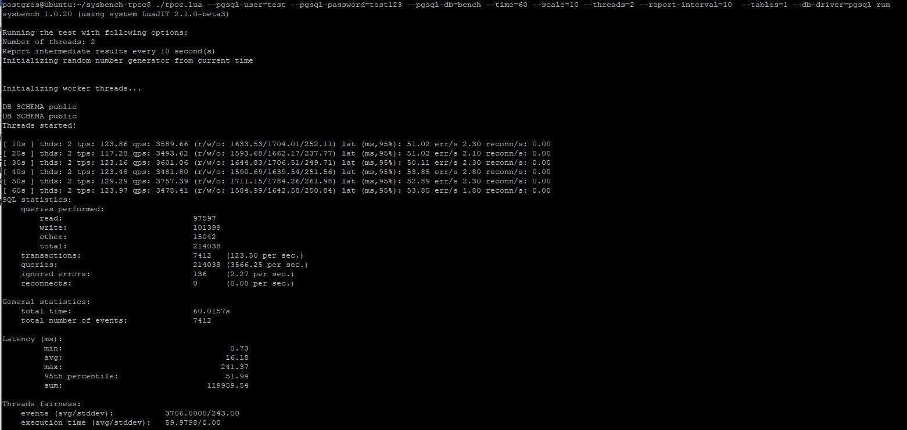

**Развернуть виртуальную машину любым удобным способом**<br>
**Поставить на неё PostgreSQL 15 любым способом**<br>

Создаем БД для тестов:
```
create database bench;
```
инициализация бд для тестов:
```
pgbench -i bench
```
Тест с настройками по умолчанию:
```
pgbench -c8 -P 6 -T 60 bench
```
<br>

**Настроить кластер PostgreSQL 15 на максимальную производительность не обращая внимание на возможные проблемы с надежностью в случае аварийной перезагрузки виртуальной машины**
**Нагрузить кластер через утилиту через утилиту pgbench (https://postgrespro.ru/docs/postgrespro/14/pgbench)**
**Написать какого значения tps удалось достичь, показать какие параметры в какие значения устанавливали и почему**

В файл nano /etc/postgresql/15/main/conf.d/custom.conf были добавлены следующие параметры:
```
max_connections = 100 # Максимальное количество сессий
shared_buffers = 1GB # Задаёт объём памяти, который будет использовать сервер баз данных для буферов в разделяемой памяти
effective_cache_size = 3GB  # Определяет представление планировщика об эффективном размере дискового кеша, доступном для одного запроса
maintenance_work_mem = 256MB # Задаёт максимальный объём памяти для операций обслуживания БД
checkpoint_completion_target = 0.9 # задаётся как часть интервала контрольной точки
wal_buffers = 16MB # Объём разделяемой памяти, который будет использоваться для буферизации данных WAL, ещё не записанных на диск. 
default_statistics_target = 100
random_page_cost = 1.1
effective_io_concurrency = 200 # Задаёт допустимое число параллельных операций ввода/вывода, которое говорит о том, сколько операций ввода/вывода могут быть выполнены одновременно
work_mem = 16MB # Задаёт объём памяти, который будет использоваться для внутренних операций сортировки и хеш-таблиц, прежде чем будут задействованы временные файлы на диске
huge_pages = off # Включает/отключает использование огромных страниц памяти.
min_wal_size = 1GB # Минимальный размер WAL файла
max_wal_size = 4GB # Максимальный размер, до которого может вырастать WAL между автоматическими контрольными точками в WAL
```
Прирост по сравнению с конфигом по умолчанию составил 3.9% tps<br>
<br>
Значительный прирост производительности дает вылючение synchronous_commit
```
PGOPTIONS="-c synchronous_commit=off" pgbench -c8 -P 6 -T 60 -U postgres bench
```
Прирост по сравнению с конфигом по умолчанию составил 426% tps
<br>

**Задание со звездочкой: аналогично протестировать через утилиту https://github.com/Percona-Lab/sysbench-tpcc (требует установки https://github.com/akopytov/sysbench)**

Устанавливает sysbench:
```
curl -s https://packagecloud.io/install/repositories/akopytov/sysbench/script.deb.sh | sudo bash
sudo apt -y install sysbench
```
Клонируем репозиторий sysbench-tpcc:
```
git clone https://github.com/Percona-Lab/sysbench-tpcc && cd sysbench-tpcc
```
Запускаем инициализацию и тест с дефолтными настройками:
```
./tpcc.lua --pgsql-user=test --pgsql-password=test123 --pgsql-db=bench --time=60 --scale=10 --threads=2 --report-interval=1  --tables=1 --db-driver=pgsql prepare
./tpcc.lua --pgsql-user=test --pgsql-password=test123 --pgsql-db=bench --time=60 --scale=10 --threads=2 --report-interval=10  --tables=1 --db-driver=pgsql run
```
Результат тестов:


После внесения изменений в конфиг постгреса получаем следующую картину:

Немного вырос tps, сильно уменьшился максимальный latency