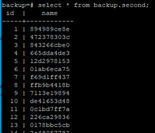
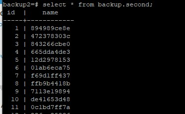
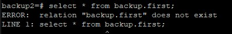

**Создаем ВМ/докер c ПГ.**<br>
**Создаем БД, схему и в ней таблицу.**
```
create database backup;
```
**Заполним таблицы автосгенерированными 100 записями.**
```
create table backup.first as select generate_series(1,100) as id, md5(random()::text)::char(10) as name;
```
**Под линукс пользователем Postgres создадим каталог для бэкапов**
```
mkdir /tmp/backup
```
**Сделаем логический бэкап используя утилиту COPY**
```
copy backup.first TO '/tmp/backup/first.sql';
```
**Восстановим в 2 таблицу данные из бэкапа.**<br>
Для восстановления во вторую таблицу нужно ее сначала создать:
```
create table backup.second(id serial, name char(10));
copy backup.second from '/tmp/backup/first.sql';
```
<br>
**Используя утилиту pg_dump создадим бэкап в кастомном сжатом формате двух таблиц**
```
pg_dump -d backup -t backup.first -t backup.second -Fc > /tmp/backup/backup.gz
```
**Используя утилиту pg_restore восстановим в новую БД только вторую таблицу!**<br>
Создадим схему backup вручную:
```
create database backup2;
\c backup2;
create scheme backup;
pg_restore -d backup2 -n backup -t second -FC /tmp/backup/backup.gz
```
<br>


